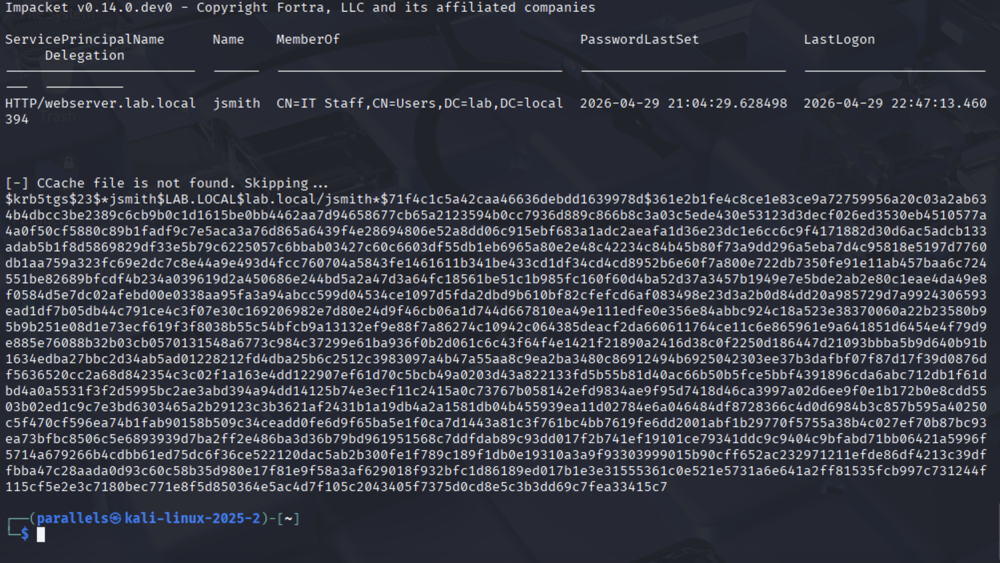
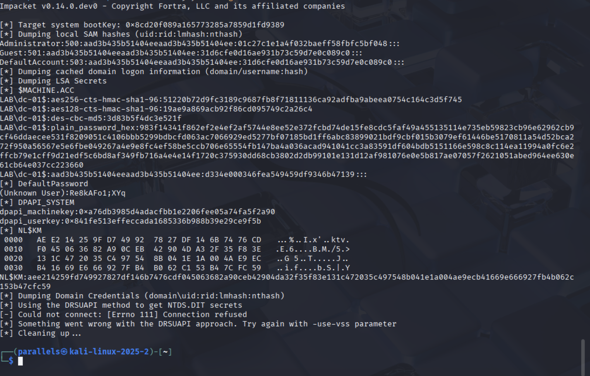
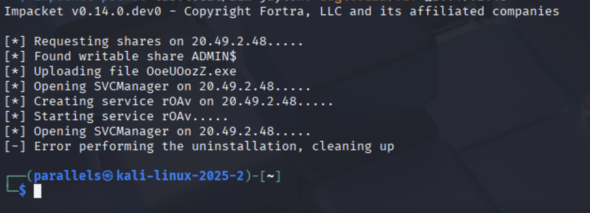
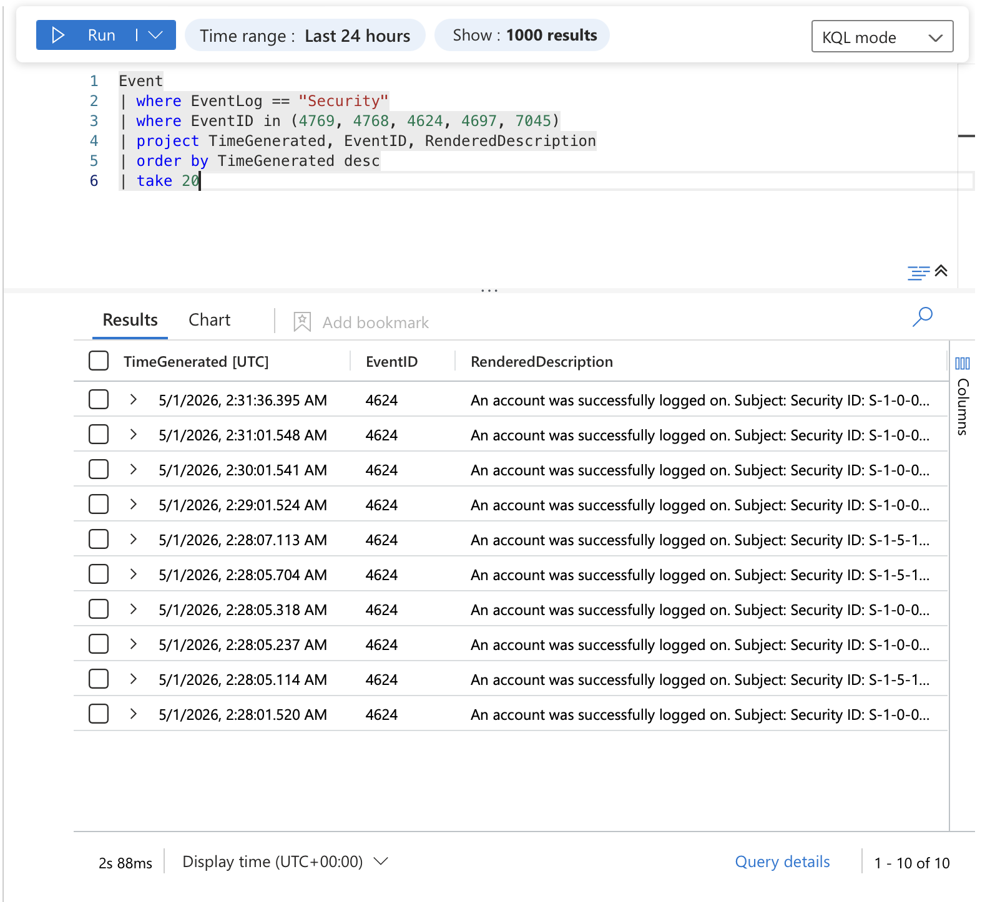
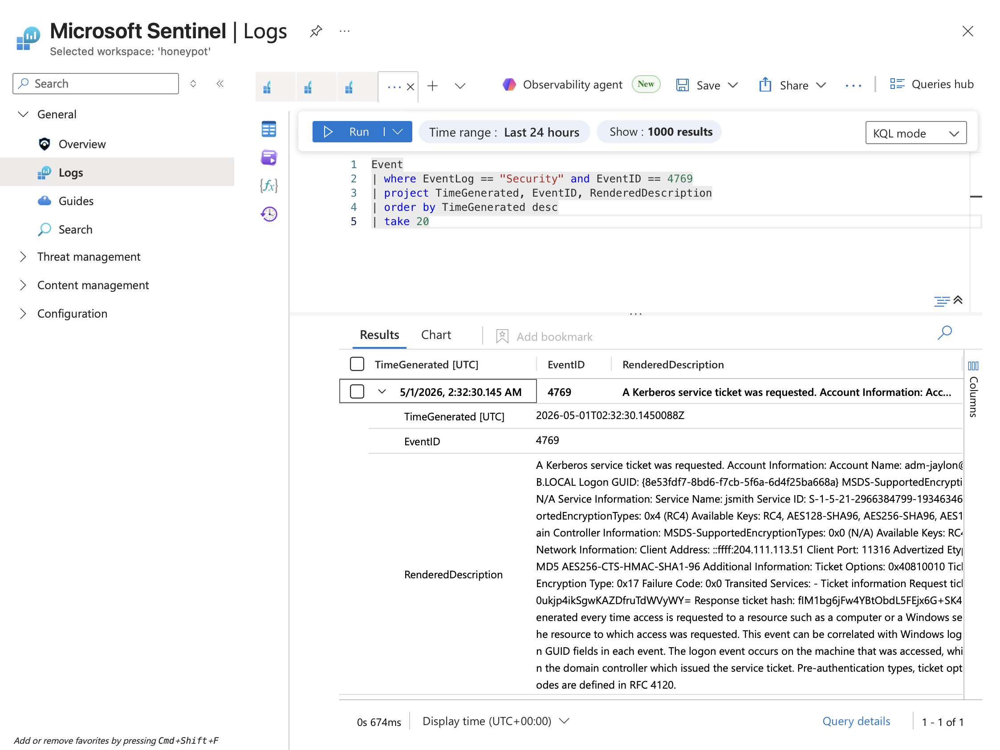

# Azure Active Directory Attack & Defense Lab

A hands-on red team/blue team lab built on Microsoft Azure simulating real-world Active Directory attacks and detecting them using Microsoft Sentinel. Demonstrates the full attack lifecycle — credential theft, credential dumping, and remote code execution — paired with SIEM-based detection.

---

## Screenshots

### Kerberoasting — Hash Extraction


### Secretsdump — Credential Dump


### PSExec — Remote Code Execution


### Sentinel — Attack Detection


### Sentinel — Kerberoasting Detection


---

## Lab Architecture
Kali Linux (Attacker) → Internet → Azure Virtual Network (ad-lab-vnet)
├── dc-01 — Windows Server 2025 (10.0.0.4)
│     Active Directory Domain: lab.local
└── victim-01 — Windows 10 Enterprise (10.0.0.5)
Domain joined: lab.local

## Attacks Performed

### 1. Kerberoasting — T1558.003
Extracted Kerberos service ticket hash for `jsmith` service account using Impacket. RC4 encryption downgrade confirmed via EventID 4769 in Sentinel.

```bash
impacket-GetUserSPNs lab.local/adm-jaylon:'password' -dc-ip 20.49.2.48 -request
```

### 2. Credential Dumping — T1003.002
Remotely dumped SAM hashes and LSA secrets from the domain controller including Administrator NTLM hash and cleartext DefaultPassword.

```bash
impacket-secretsdump lab.local/adm-jaylon:'password'@20.49.2.48
```

### 3. Remote Code Execution — T1569.002
Achieved SYSTEM-level code execution on the domain controller via SMB using PSExec — uploaded service binary to ADMIN$ share and created remote service.

```bash
impacket-psexec lab.local/adm-jaylon:'password'@20.49.2.48
```
---

## Detection in Microsoft Sentinel

```kql
Event
| where EventLog == "Security"
| where EventID in (4769, 4768, 4624, 4697, 7045)
| project TimeGenerated, EventID, RenderedDescription
| order by TimeGenerated desc
```

### MITRE ATT&CK Coverage

| Tactic | Technique | ID | EventID |
|--------|-----------|-----|---------|
| Credential Access | Kerberoasting | T1558.003 | 4769 |
| Credential Access | OS Credential Dumping | T1003.002 | 4624 |
| Execution | Service Execution | T1569.002 | 4697 |
| Lateral Movement | Remote Services | T1021.002 | 4624 |

---

## Defensive Recommendations

| Attack | Mitigation |
|--------|-----------|
| Kerberoasting | Enforce AES-256 encryption, use 25+ char service account passwords |
| Credential Dumping | Enable Credential Guard, restrict remote registry access |
| PSExec | Disable ADMIN$ share, restrict SMB via firewall rules |

---

## Skills Demonstrated

- Active Directory domain setup and user/group management
- Red team attack execution using Impacket toolkit
- Kerberoasting, credential dumping, and lateral movement techniques
- Microsoft Sentinel log ingestion via Azure Monitor and Data Collection Rules
- KQL threat hunting for AD attack detection
- MITRE ATT&CK framework mapping
